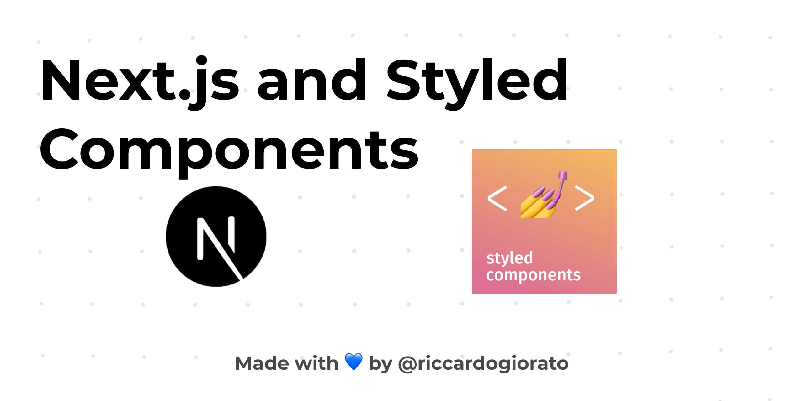

# template-nextjs-styled-components

Template with Next.js 12 and Typescript and Styled Components using SWC (Rust Compiler)

## No Extra packages added, super light version!



This is a [Next.js](https://nextjs.org/) and with [Styled Components](https://styled-components.com/)

## Getting Started

First, run the development server:

```bash
npm run dev
# or
yarn dev
```

Open [http://localhost:3000](http://localhost:3000) with your browser to see the result.

You can start editing the page by modifying `src/pages/index.js`. The page auto-updates as you edit the file.
